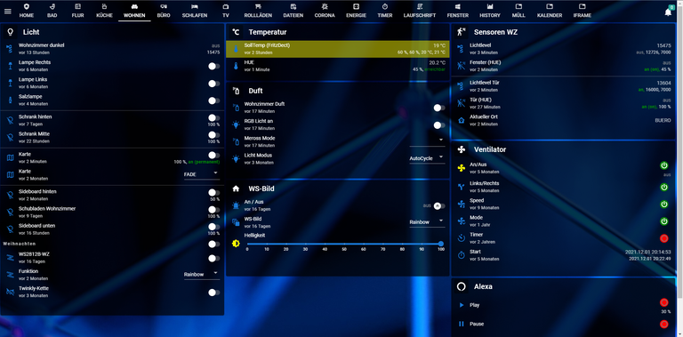

# Jarvis
(22.01.2026 IN BEARBEITUNG)
**Jarvis** ist eine moderne, konfigurierbare Oberfläche (Dashboard/Visualisierung) für **ioBroker**, mit der du Geräte- und Zustände übersichtlich darstellen und steuern kannst – vom Handy bis zur Wand-Tablets.

> Ziel: **Schnell startklar**, später **beliebig erweiterbar** (Seiten, Widgets, Themes, Rollen, …).

---

## Vorschau

> Füge hier 1–3 Screenshots oder ein kurzes GIF ein (das ist für neue User extrem hilfreich).

---

## Features

- 📱 Responsives UI für Smartphone, Tablet, Desktop
- 🧩 Widgets/Komponenten für typische Smart-Home-Anwendungsfälle
- 🎨 Themes, Farben, Icons, Layouts
- 🔐 Optional: Zugriffsschutz / Rollen-Konzept (je nach Setup)
- ⚡ Schnelle Reaktionszeiten (States/DPs in Echtzeit)
- 🧰 Gut dokumentierbar & versionierbar (Konfiguration/Export, je nach Setup)

---

## Für wen ist das?

- Du nutzt ioBroker und möchtest eine **schöne, schnelle Visualisierung**
- Du willst **ein Dashboard pro Raum**, **Szenen**, **Statusanzeigen**, **Schalter**, **Charts**
- Du möchtest eine Lösung, die auch **auf Wandtablets** sauber läuft

---

## Voraussetzungen

- ioBroker (aktuelle Version empfohlen)
- Node.js: siehe ioBroker-Empfehlung (abhängig von deiner ioBroker-Version)
- Netzwerkzugriff vom Client (Browser/Tablet) auf den ioBroker-Host

---

## Quickstart (10 Minuten)

### 1) Installation in ioBroker
1. Öffne **ioBroker Admin**
2. Gehe zu **Adapter**
3. Suche nach **Jarvis**
4. **Installieren** und anschließend eine **Instanz** anlegen

### 2) Instanz konfigurieren
- Öffne die Jarvis-Instanz (Zahnrad/Instanz-Konfiguration)
- Setze mindestens:
  - **Port** (falls konfigurierbar)
  - **Basis-Einstellungen** (Sprache/Theme/Startseite – je nach Jarvis-Version)

### 3) Aufrufen im Browser
- Öffne im Browser:  
  `http://<IOBROKER-IP>:<PORT>/`  
  Beispiel: `http://192.168.178.33:3000/`

### 4) Erste Kachel / erstes Widget
- Lege eine **Seite** an (z. B. „Wohnzimmer“)
- Füge ein Widget hinzu (z. B. **Schalter**)
- Verknüpfe es mit einem ioBroker **Datenpunkt (State)**  
  Beispiel: `zigbee.0.<gerät>.state` / `zwave.0.<gerät>.targetValue`

✅ Fertig: Du hast ein erstes funktionierendes Dashboard.

---

## Projektstruktur dieser Doku

- **README.md** → Schnellüberblick & Quickstart (du bist hier)
- `docs/01-installation.md` → Installation & Updates (inkl. Troubleshooting)
- `docs/02-konzept.md` → Begriffe & Architektur (Mental Model)
- `docs/03-konfiguration.md` → Alle Optionen + Beispiele
- `docs/04-tutorials/` → Schritt-für-Schritt Anleitungen
- `docs/05-referenz/` → Widget-/Optionen-Referenz (Nachschlagewerk)
- `docs/06-faq.md` → Häufige Fragen & typische Fehlerbilder

---

## Typische Anwendungsfälle

- ✅ Licht schalten/dimmen (mit Status & Icon)
- ✅ Rollläden (Position, Tasten, Automatik)
- ✅ Heizungs-Übersicht (Soll/Ist, Modus, Zeitpläne)
- ✅ Fenster/Türen (offen/zu, Alarm, Historie)
- ✅ Szenen („Alles aus“, „Gute Nacht“, „Kino“)

---

## Beispiele

> Hier lohnt sich ein eigener Ordner mit Beispiel-Seiten/Widgets (Screenshots + kurze Erklärung).

- `docs/04-tutorials/erste-seite.md`
- `docs/04-tutorials/licht-schalten.md`
- `docs/04-tutorials/rollladen.md`

---

## Troubleshooting (Kurz)

### Jarvis lädt nicht / Seite bleibt leer
- Port erreichbar? `http://<ip>:<port>/`
- Browser-Cache leeren (Test im Inkognito-Modus)
- ioBroker-Log prüfen (Adapter-Instanz)

### States reagieren nicht
- Prüfe, ob der Datenpunkt korrekt ist (Admin → Objekte)
- Schreib-/Leserechte (falls Rollen/ACL aktiv)
- Prüfe, ob der State beim Schalten wirklich wechselt

> Ausführlicher: siehe `docs/06-faq.md`

---

## Roadmap (optional)

- [ ] Mehr Widgets / Templates
- [ ] Import/Export-Workflows verbessern
- [ ] Doku/Beispiele ausbauen
- [ ] Performance-Optimierungen

---

## Mitmachen / Support

- Issues: Bitte mit **Version**, **ioBroker-Version**, **Browser**, **Logs**, **Repro-Schritten**
- PRs willkommen: siehe `CONTRIBUTING.md`

---

## Lizenz

Siehe `LICENSE`.

---

## Credits

- ioBroker Community
- Icons/Libs (falls verwendet) in `docs/credits.md`
